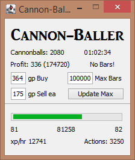

# Cannon-Baller

Smiths cannonballs in Edgeville. Start in Edgeville, and it will detect whether to start at the bank or go straight to the furnace. 
As soon as the start button is pressed it will start running the bot.
A small amount of load time (usually 5-10 seconds) will happen, and this is just for the window to pop up and for the bot to determine what needs to happen first.

## Recommended for mobile only due to there being no anti-ban features included.

Very low requirements! Only 35 smithing and Dwarf Cannon quest are needed.
Low starting capital makes it easy to manage risk while still maximizing profits.

## Features

* Easy click and play running
  * Start at the login screen or somewhere in Edgeville
  * Once the start button is pressed there is no more need for more human interaction
* Supports breaks
* Calculates the amount of profit earned as the bot runs with the given inputs
* No random crashes or unintended behavior. The bot will automatically restart the smithing process if something adverse happens.
  * Walks back to Edgeville if something causes the bot to walk too far away.
* Capable of limiting how many bars to use
* Keeps track of gained experience as well as experience per hour and experience to next level
  * Also displays how many actions are left until the next level
* Smelts ~500 bars (2000 cannonballs) an hour consistently
  * ~120k profit (320k total value) an hour
* Automatically suspends the bot and logs out when there are no more steel bars available or when the bars used limit has been reached

## Future updates

* Automatic traveling to the GE to sell cannonballs and to buy steel bars.
* Automatic offloading onto a mule account

